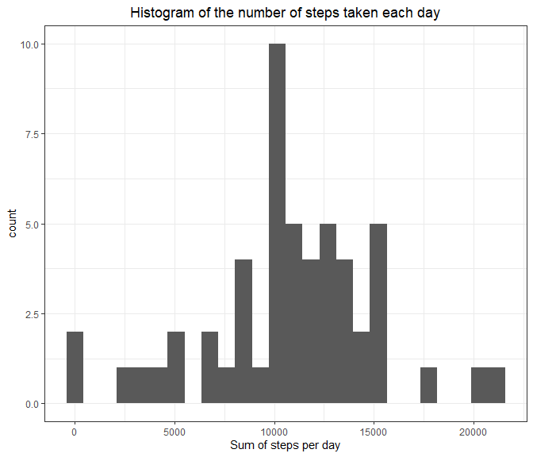
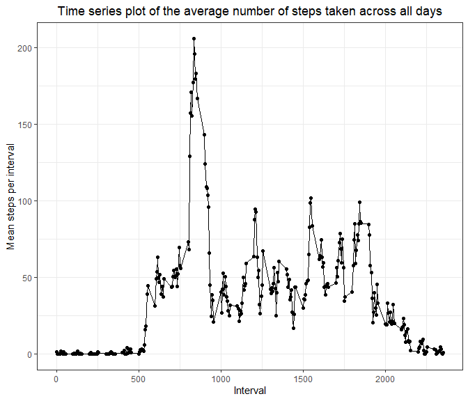
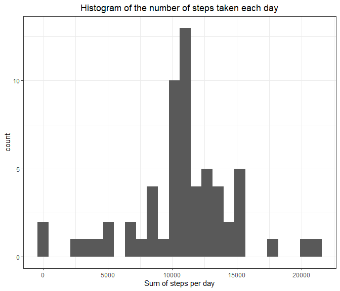

```r
# Global R markdown code chunk options
knitr::opts_chunk$set(message=FALSE, 
                      warning = FALSE, 
                      error=FALSE, 
                      echo=TRUE, 
                      cache=FALSE, 
                      fig.width = 7, fig.height = 6, 
                      fig.align = 'left')
```


# 1. Loading and preprocessing the data


```r
library(data.table)
library(ggplot2)

unzip("activity.zip")
data <- read.csv("activity.csv")

# Converting to a data.table object, omitting missing values (NA)
DT <- data.table(na.omit(data))
```

# 2. What is mean total number of steps taken per day?

For this part of the assignment, you can ignore the missing values in the dataset.

## 2.1 Make a histogram of the total number of steps taken each day


```r
# sum(is.na(data$steps)) / length(data$steps) 13% of step records are missing 


df <- DT[, .(sum_of_steps_per_day = sum(steps)), by=list(date)]

ggplot(df, aes(x=sum_of_steps_per_day))+
    geom_histogram(bins = 26)+
    theme_bw()+
    labs(title = "Histogram of the number of steps taken each day",
         x = "Sum of steps per day")+
    theme(plot.title = element_text(hjust = 0.5))
```



## 2.2 Calculate and report the mean and median total number of steps taken per day


```r
mean_n_of_steps <- mean(df$sum_of_steps_per_day)
median_n_of_steps <- median(df$sum_of_steps_per_day)
```

The mean number of steps taken each day is 10766.19, and the median is 10765

# 3. What is the average daily activity pattern?

## 3.1 Time series plot of the average number of steps taken across all days

Make a time series plot (i.e. type = "l") of the 5-minute interval (x-axis) and the average number of steps taken, averaged across all days (y-axis)


```r
df <- DT[, .(mean_steps = mean(steps)), by=list(interval)]

ggplot(df, aes(x = interval, y = mean_steps))+
    geom_point()+
    geom_line()+
    theme_bw()+
    labs(title = "Time series plot of the average number of steps taken across all days",
         x = "Interval", 
         y = "Mean steps per interval")+
    theme(plot.title = element_text(hjust = 0.5))
```



## 3.2 Which 5-minute interval, on average across all the days in the dataset, contains the maximum number of steps?


```r
as.numeric(df[which.max(df$mean_steps), 1])
```

On average, interval 835 contains the maximum number of steps.

# 4. Imputing missing values

Note that there are a number of days/intervals where there are missing values (coded as NA). The presence of missing days may introduce bias into some calculations or summaries of the data.

## 4.1 Calculate and report the total number of missing values in the dataset (i.e. the total number of rows with NAs)


```r
sum(as.numeric((is.na(data))))
```

```
## [1] 2304
```

The total number of rows containing NAs is 2304

## 4.2 Imputation of missing data

Devise a strategy for filling in all of the missing values in the dataset. The strategy does not need to be sophisticated. For example, you could use the mean/median for that day, or the mean for that 5-minute interval, etc


```r
# Calculates mean activity per interval, which will be used to fill in missing values
df <- DT[, .(mean_steps = mean(steps)), by=list(interval)]
#sum(is.na(df)) # No NA values
```

## 4.3 Create a new dataset that is equal to the original dataset but with the missing data filled in.

```r
# Replaces missing values with mean interval values 
data_imp <- merge(data, df, by = "interval", all.x = TRUE)
data_imp$steps <- ifelse(is.na(data_imp$steps), data_imp$mean_steps, data_imp$steps)

#Sanity check. There are no missing values in the imputed dataset.
sum(is.na(data_imp))
```

```
## [1] 0
```

## 4.4 Make a histogram of the total number of steps taken each day and calculate and report the mean and median total number of steps taken per day.  


```r
DT <- data.table(na.omit(data_imp))
df <- DT[, .(sum_of_steps_per_day = sum(steps)), by=list(date)]

ggplot(df, aes(x=sum_of_steps_per_day))+
    geom_histogram(bins = 26)+
    theme_bw()+
    labs(title = "Histogram of the number of steps taken each day",
         x = "Sum of steps per day")+
    theme(plot.title = element_text(hjust = 0.5))
```




```r
mean_n_of_steps_imp <- mean(df$sum_of_steps_per_day)
median_n_of_steps_imp <- median(df$sum_of_steps_per_day)
```

The mean number of steps taken each day in the imputed data is 10766.19, and the median is 10766.19

### 4.4.1 Do these values differ from the estimates from the first part of the assignment?

Only the median value is slightly different, and now is equal to the mean value. Overall, the process of data imputation did not have a major effect on the data.

### 4.4.2 What is the impact of imputing missing data on the estimates of the total daily number of steps?


```r
DT <- data.table(data)
df <- DT[, .(sum_of_steps_per_day = sum(steps)), by=list(date)]

DT <- data.table(data_imp)
df_imp <- DT[, .(sum_of_steps_per_day = sum(steps)), by=list(date)]

df_merged <- merge(df, df_imp, by = "date", all.y = TRUE)
colnames(df_merged) <- c("date", "sum_of_steps_per_day.raw", "sum_of_steps_per_day.imputed")
df_merged$Imputation <- ifelse(is.na(df_merged$sum_of_steps_per_day.raw), "Imputed daily value", "Raw values")

df_merged$sum_of_steps_per_day.raw <- ifelse(is.na(df_merged$sum_of_steps_per_day.raw), 0 , df_merged$sum_of_steps_per_day.raw)


ggplot(df_merged, aes(x = sum_of_steps_per_day.raw, y = sum_of_steps_per_day.imputed, color = Imputation))+
    geom_abline(intercept = 1)+
    geom_point()+
    theme_bw()+
    labs(title = "Raw vs imputed daily sums of steps")+
    theme(plot.title = element_text(hjust = 0.5))
```


```r
# Testing how many values of the sum of steps per day repeat in the imputed data set. These values were assigned in a process of imputation to days consisting only of NAs.  

sum(df_merged$Imputation == "Imputed daily value")
```

```
## [1] 8
```

The only missing values in a data set occur over the entire 8 days. Therefore, the implemented method of data imputation did not have any effect on other days. This is represented by perfect correlation of the raw vs imputed sums of steps. The imputed missing days have a value of the overall mean sum of steps. To visualize them I arbitrarily assigned to them a value of 0 sum_of_steps_per_day.raw. 


# 5. Are there differences in activity patterns between weekdays and weekends?

For this part the weekdays() function may be of some help here. Use the dataset with the filled-in missing values for this part.

## 5.1 Create a new factor variable in the dataset with two levels -- "weekday" and "weekend" indicating whether a given date is a weekday or weekend day.


```r
data_imp$weekday_type <- factor(ifelse(weekdays(as.Date(data_imp$date)) %in% c("Saturday", "Sunday"), "weekend", "weekday"))
```

## 5.2 Make a panel plot containing a time series plot.


```r
DT <- data.table(data_imp)
df <- DT[, .(mean_steps = mean(steps)), by=list(interval, weekday_type)]

ggplot(df, aes(x = interval, y = mean_steps))+
    geom_point()+
    geom_line()+
    theme_bw()+
    labs(title = "Time series plot of the average number of steps taken across all days",
         x = "Interval", 
         y = "Mean steps per interval")+
    theme(plot.title = element_text(hjust = 0.5))+
    facet_grid(weekday_type ~.)
```


